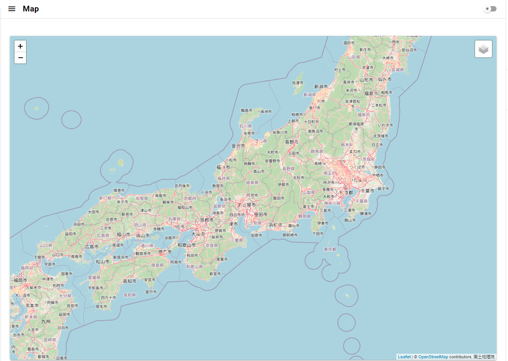
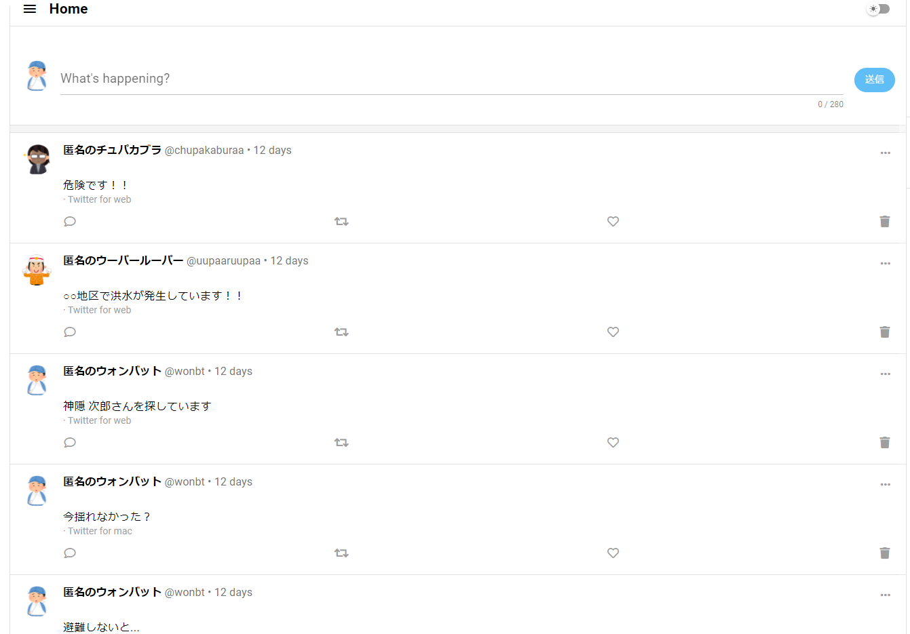

# Map_Twister

災害エリアに特化した**Map**と**Twi**tter likeな掲示板を組み合わせてDisa**ster**を解決したいアプリ

## 導入

```bash
npm install
npm install vue2-leaflet leaflet --save
```

## 設定

[src/boot/firebase.js](src/boot/firebase.js)の変更
- `firebaseConfig` を自分の情報に変更

### 設定のカスタマイズ

[Configuring quasar.conf.js](https://quasar.dev/quasar-cli/quasar-conf-js)を参照

## 起動

```bash
quasar dev
```

## プレビュー

 

## 参考

[EspiraMarvin/twitter-clone - GitHub](https://github.com/EspiraMarvin/twitter-clone)
